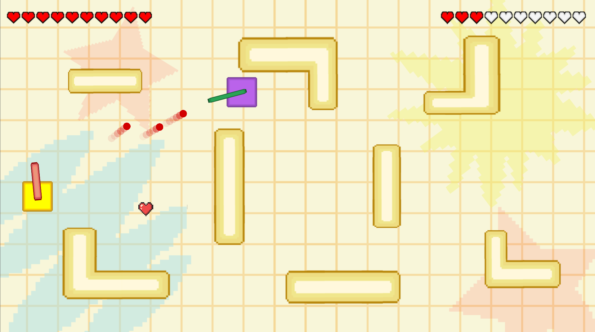
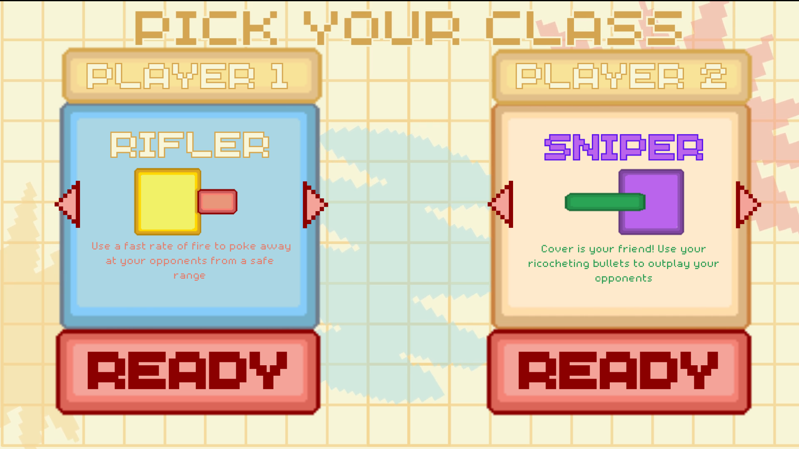

[![Contributors][contributors-shield]][contributors-url]
[![Issues][issues-shield]][issues-url]
[![MIT License][license-shield]][license-url]
[![LinkedIn][linkedin-shield]][linkedin-url]

<!-- PROJECT LOGO -->
 

  

<h3 align="center"></h3>

  

    COMP 225
     
    Software Design and Development
     
     
    <a href="https://github.com/aidan-lincicum/TwoLeftFeet"><strong>Explore the docs »</strong></a>
     
     
    <a href="https://github.com/github_username/repo_name](https://github.com/aidan-lincicum/TwoLeftFeet/blob/main/TwoLeftFeet.exe">View Demo</a>
    ·
    <a href="https://github.com/aidan-lincicum/TwoLeftFeet/issues/new?labels=bug&template=bug-report---.md">Report Bug</a>
    ·
    <a href="https://github.com/aidan-lincicum/TwoLeftFeet/issues/new?labels=enhancement&template=feature-request---.md">Request Feature</a>
  

<!-- TABLE OF CONTENTS -->

  
Table of Contents

  <ol>
    <li>
      <a href="#about-the-project">About The Project</a>
      <ul>
        <li><a href="#built-with">Built With</a></li>
      </ul>
    </li>
    <li>
      <a href="#getting-started">Getting Started</a>
      <ul>
        <li><a href="#prerequisites">Prerequisites</a></li>
      </ul>
    </li>
    <li><a href="#license">License</a></li>
    <li><a href="#contact">Contact</a></li>
    <li><a href="#acknowledgments">Acknowledgments</a></li>
  </ol>

<!-- ABOUT THE PROJECT -->
## About The Project

  
   

Dive into the twisty tank battles of "Two Left Feet," a dynamic two-player game where your turrets can only turn left! Choose from different tank classes, each with its own strengths, and navigate the battlefield to pick up power-ups strategically placed around the map. With limited turret movement, every match requires skillful positioning and clever tactics to outmaneuver your opponent. Are you ready to twist and turn your way to victory?

(<a href="#readme-top">back to top</a>)

### Built With

(<a href="#readme-top">back to top</a>)

<!-- GETTING STARTED -->
## Getting Started

Ready to jump into the action? Just download the [.exe file](https://github.com/aidan-lincicum/TwoLeftFeet/blob/main/TwoLeftFeet.exe), grab a friend, pick your class, and let the tank battles begin!

### Prerequisites

No prerequisites needed! However, if you're interested in exploring the game files yourself, simply download the Godot Engine and open this Github repo as a project.

(<a href="#readme-top">back to top</a>)

<!-- LICENSE -->
## License

Distributed under the MIT License. See `LICENSE.txt` for more information.

(<a href="#readme-top">back to top</a>)

<!-- CONTACT -->
## Contact

* Quinn Tange - qtange@macalester.edu
* Aidan Lincicum - alincicu@macalester.edu
* Bambi Nguyen - bnguyen@macalester.edu 
* Youssef Aithmad - yaithmad@macalester.edu

(<a href="#readme-top">back to top</a>)

<!-- ACKNOWLEDGMENTS -->
## Acknowledgments

* [Paul Cantrell](https://www.macalester.edu/mscs/facultystaff/paulcantrell/)

(<a href="#readme-top">back to top</a>)

<!-- MARKDOWN LINKS & IMAGES -->
<!-- https://www.markdownguide.org/basic-syntax/#reference-style-links -->
[contributors-shield]: https://img.shields.io/github/contributors/aidan-lincicum/TwoLeftFeet.svg?style=for-the-badge
[contributors-url]: https://github.com/aidan-lincicum/TwoLeftFeet/graphs/contributors
[issues-shield]: https://img.shields.io/github/issues/aidan-lincicum/TwoLeftFeet.svg?style=for-the-badge
[issues-url]: https://github.com/aidan-lincicum/TwoLeftFeet/issues
[license-shield]: https://img.shields.io/github/license/othneildrew/Best-README-Template.svg?style=for-the-badge
[license-url]: https://github.com/aidan-lincicum/TwoLeftFeet/LICENSE.txt
[linkedin-shield]: https://img.shields.io/badge/-LinkedIn-black.svg?style=for-the-badge&logo=linkedin&colorB=555
[linkedin-url]: https://linkedin.com/in/linkedin_username
<!-- PUT IN YOUR LINKEDIN URL ABOVE-->
[product-screenshot]: Images/gameplay_img.png
